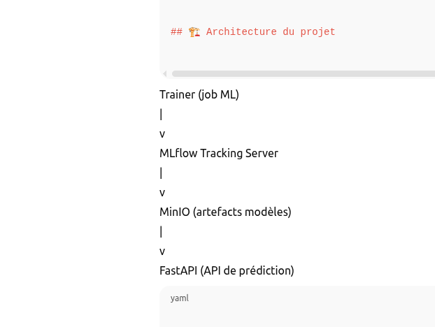

# Projet MLOps – Pipeline Data Science avec Docker Compose

## Objectif
Ce projet a pour but de **comprendre et pratiquer Docker Compose dans un contexte Data Science / MLOps**.
On utilise git pour le controle de version pour garder l'historique des modifications

Il met en place une architecture complète permettant :
- l’entraînement de modèles ML
- le suivi des expériences avec Mlflow
- le stockage des artefacts
- l’exposition d’un modèle via une API

---

## Architecture du projet
L’architecture globale est décrite ci-dessous :


---

## Services

### - Trainer
- Entraîne un modèle de Machine Learning(classification iris)
- Enregistre les métriques et modèles

### - MLflow
- Tracking des expériences
- Gestion des modèles

### - API
- Expose le modèle entraîné
- Endpoint REST

---

## Lancer le projet

```bash
docker-compose up -d
```

##  Arrêter le projet
docker-compose down