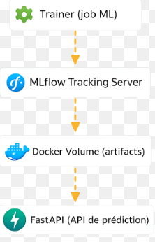
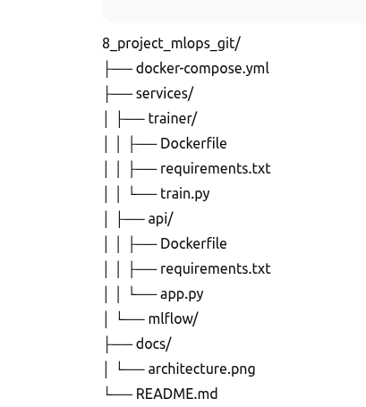

# 🧠 MLOps Iris Project

## 🎯 Objectif
Ce projet a pour but de mettre en place une **stack MLOps complète** permettant de :

- entraîner un modèle de machine learning
- tracer les expériences (paramètres, métriques, modèles)
- stocker les artifacts de manière persistante
- exposer une API de prédiction
- orchestrer l’ensemble avec Docker Compose

👉 Il s’agit d’un **mini-projet MLOps réaliste**, proche d’une architecture production.

---

## 🧱 Architecture

### Services principaux
- **trainer** : job batch d’entraînement du modèle
- **mlflow** : tracking server (experiments, runs, artifacts)
- **api** : API FastAPI pour servir le modèle
- **volumes Docker** : persistance des données et modèles


## 🧱 Architecture

### Services principaux
- **trainer** : job batch d’entraînement du modèle
- **mlflow** : tracking server (experiments, runs, artifacts)
- **api** : API FastAPI pour servir le modèle
- **volumes Docker** : persistance des données et modèles


---

---

## 📁 Structure du projet



## 🔁 Pipeline MLOps

### 1️⃣ Entraînement (trainer)
- Chargement du dataset Iris
- Entraînement d’un `RandomForestClassifier`
- Logging dans MLflow :
  - paramètres (ex: `n_estimators`)
  - métriques (`accuracy`)
  - artifacts (modèle, environnement, metadata)
- Sauvegarde du modèle dans un volume Docker partagé

### 2️⃣ Tracking (MLflow)
- Interface MLflow disponible sur :  
  👉 `http://localhost:5000`
- Visualisation :
  - Experiments
  - Runs
  - Metrics
  - Artifacts
- Chaque entraînement est **traçable et reproductible**

### 3️⃣ Serving (API FastAPI)
- Chargement du modèle entraîné
- Endpoints disponibles :
  - `GET /health`
  - `POST /predict`
- Documentation Swagger :
  👉 `http://localhost:8000/docs`

---

## 📦 Stockage & persistance

### Volumes Docker
| Volume | Rôle |
|------|----|
| `model_data` | Modèle utilisé par l’API |
| `mlflow_data` | Base de données MLflow (SQLite) |
| `mlflow_artifacts` | Artifacts MLflow (modèles, fichiers) |

Les données sont persistantes même après arrêt des conteneurs.

---

## 🚀 Lancer le projet

### Prérequis
- Docker
- Docker Compose

### Démarrer MLflow
```bash
docker compose up -d mlflow

docker compose up --build trainer


🧪 Tester l’API
Health check

curl http://localhost:8000/health

Prédiction
curl -X POST http://localhost:8000/predict \
  -H "Content-Type: application/json" \
  -d '{"features":[5.1,3.5,1.4,0.2]}'


🧠 Concepts MLOps abordés

Docker Compose multi-services

Job batch vs service long-running

MLflow Tracking (experiments, runs, artifacts)

Séparation training / serving

Persistance via volumes Docker

Debug MLflow (artifact_uri, proxy artifacts, sécurité Host)

🔮 Évolutions possibles

MLflow Model Registry (Production / Staging)

API branchée directement sur MLflow (models:/…)

Stockage S3 via MinIO

CI/CD (training et déploiement automatisés)

👤 Auteur

Projet réalisé dans un objectif de montée en compétences MLOps.


---

## 🧩 What I learned

Through this project, I implemented and understood key MLOps concepts:

- Designing a multi-service architecture with Docker Compose
- Separating training (batch job) and serving (API)
- Experiment tracking with MLflow (params, metrics, artifacts)
- Debugging MLflow artifacts and tracking configuration
- Managing persistence with Docker volumes
- Understanding tracking vs serving vs registry
- Exposing ML models through a REST API (FastAPI)
- Building a reproducible and explainable ML pipeline

This project reflects how an ML system can be structured in a real-world environment.
